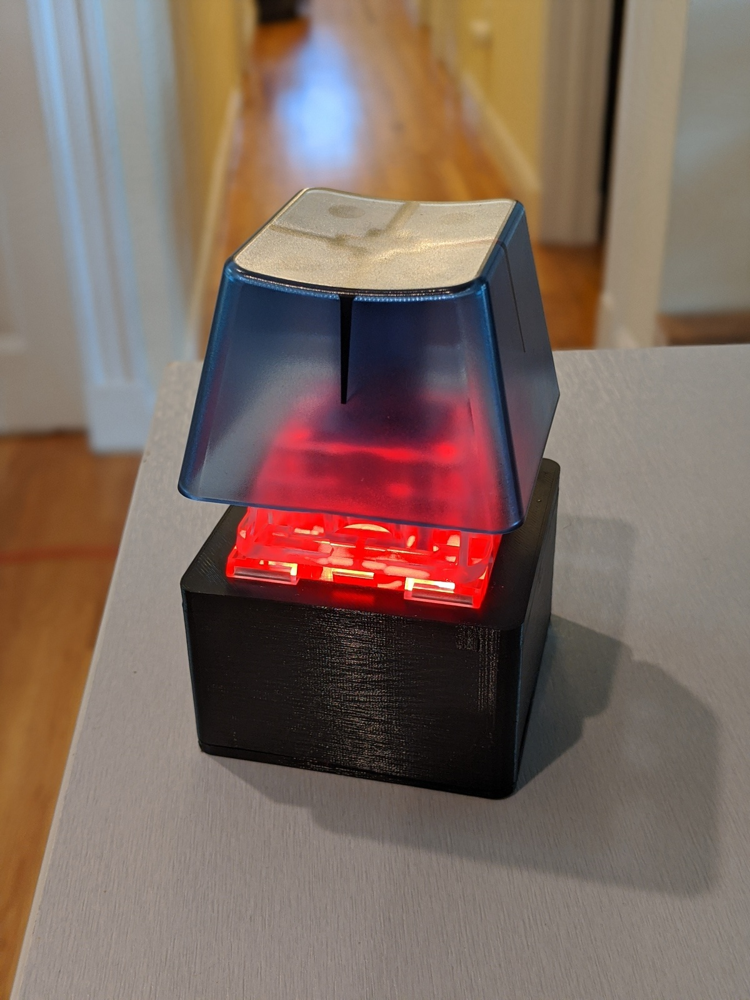

Jumbobutton
===========



Ingredients:

* [a very large button](https://novelkeys.xyz/collections/switches/products/the-big-switch-series)
* ESP8266 board (I use the D1 mini)
* a section of an addressable LED strip. I used 3 APA102 LEDs
* 3D printed housing, top and bottom (see the OpenSCAD .scad files here)
* solder, wire

Building
========

In the `esphome/` directory, do the following.

Using Pipenv:

```
pipenv install
```

Copy `secrets.yaml.example` to `secrets.yaml` and put in your own secrets.
Then run:

```
pipenv run esphome jumbo_button.yaml run
```
